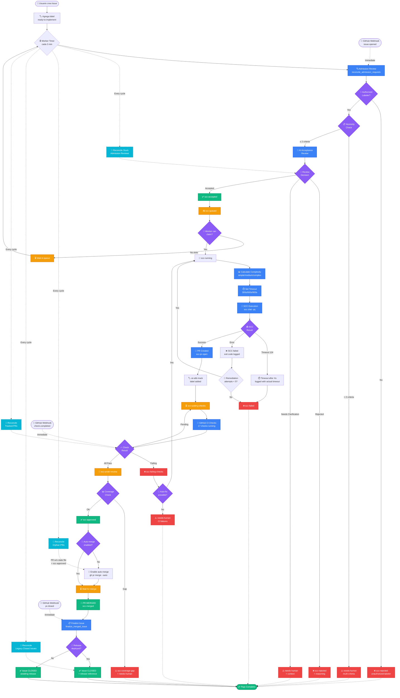
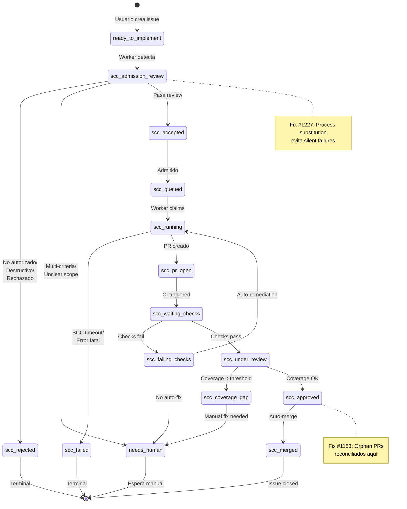
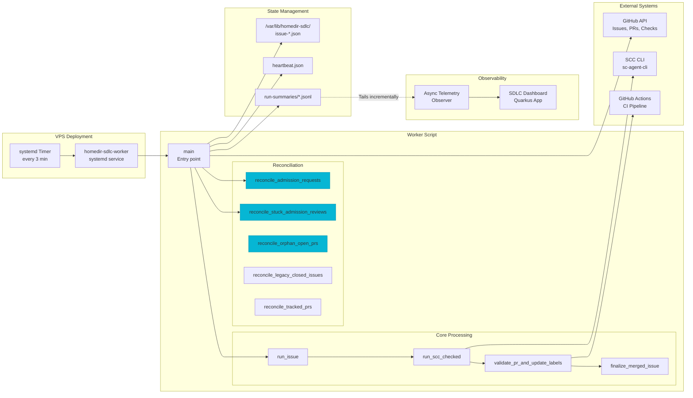
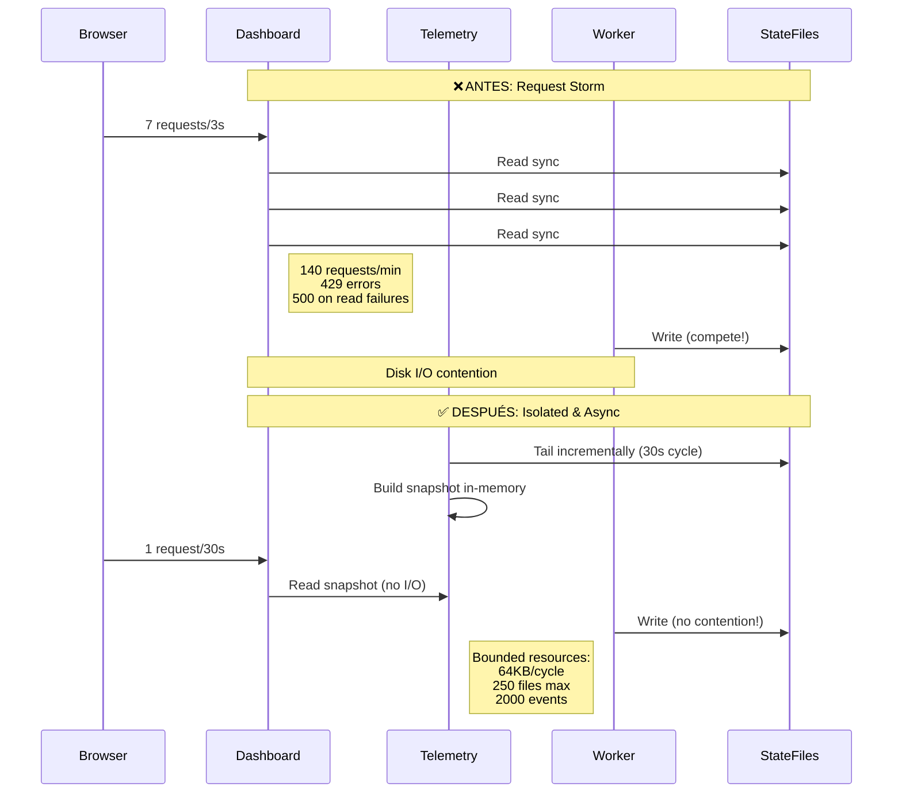
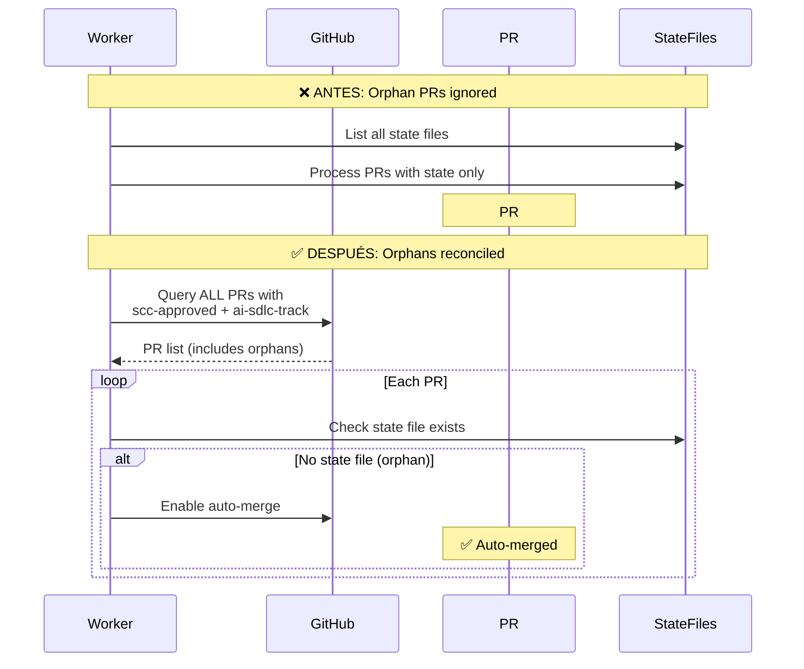
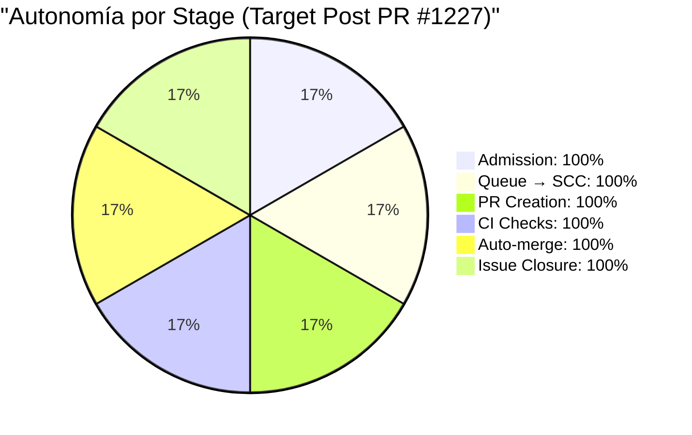
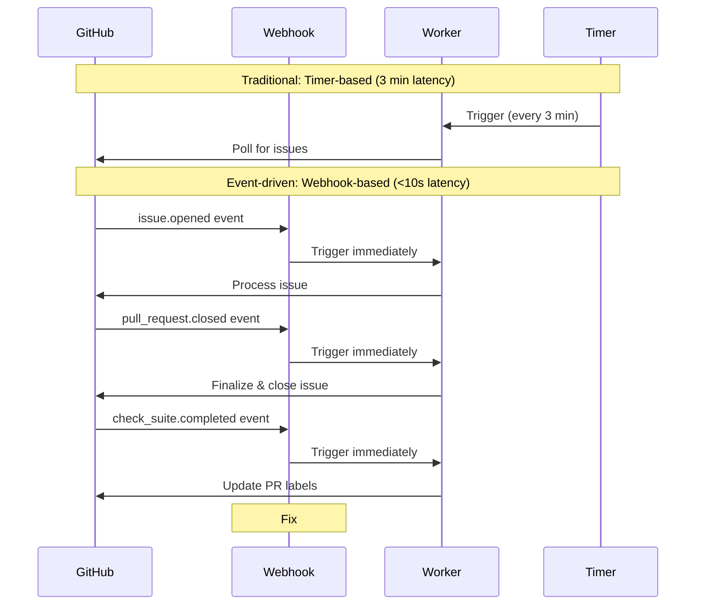

# HomeDir AI SDLC - Flujo Completo Implementado

## Diagrama del Pipeline Autónomo



## Estados del Issue/PR (Labels)

### Pipeline Principal


## Componentes del Sistema

### Worker Architecture


## Fixes Implementados (2026-07-12)

### Fix #1225 + #1226: Dashboard Isolation


### Fix #1153: Orphan PR Reconciliation


### Fix #1227: Subshell Loop Fix (Comprehensive)
```mermaid
flowchart TB
    subgraph "❌ ANTES: Pipe creates subshell"
        Pipe1[jq -c '.[]' <<<$json]
        Pipe2[| while IFS= read -r item]
        Pipe3[do<br/>  add_label # ⚠️ Fails silently<br/>done]
        
        Pipe1 --> Pipe2 --> Pipe3
        
        Note1[Subshell scope:<br/>- Variables don't persist<br/>- Label commands fail<br/>- Loop can exit early<br/>- NO error propagation]
    end
    
    subgraph "✅ DESPUÉS: Process substitution"
        Proc1[while IFS= read -r item]
        Proc2[do<br/>  add_label # ✅ Works<br/>done]
        Proc3[< <'('jq -c '.[]' <<<$json')']
        
        Proc1 --> Proc2 --> Proc3
        
        Note2[Same shell scope:<br/>✅ Variables persist<br/>✅ Commands execute<br/>✅ Errors propagate<br/>✅ + Logging added]
    end
    
    Affected[5 Loops Fixed:<br/>1. reconcile_admission_requests<br/>2. reconcile_stuck_admission_reviews<br/>3. reconcile_orphan_open_prs<br/>4. reconcile_legacy_closed_issues<br/>5. main eligible issues]
    
    style Note1 fill:#ef4444,stroke:#dc2626,color:#fff
    style Note2 fill:#10b981,stroke:#059669,color:#fff
    style Affected fill:#3b82f6,stroke:#2563eb,color:#fff
```

## Métricas de Autonomía

### Pipeline Success Rate (Post-Fixes)


### Issue Processing Time Distribution

```mermaid
gantt
    title Tiempo Promedio por Stage (minutos)
    dateFormat mm
    axisFormat %M
    
    section Admission
    Auto-acceptance : 00, 1m
    
    section Queue
    Wait in queue : 01, 3m
    
    section Execution
    SCC processing : 04, 2m
    
    section CI
    GitHub checks : 06, 2m
    
    section Review
    Auto-approval : 08, 3m
    
    section Merge
    Auto-merge : 11, 6m
    
    section Total
    E2E Complete : crit, 00, 17m
```


## Event-Driven Architecture (Opcional)

### Webhook Integration


---

## Deployment Architecture

```mermaid
graph TB
    subgraph "GitHub Repository"
        Main[main branch]
        PRs[Pull Requests]
        Actions[GitHub Actions]
        Releases[Releases]
    end
    
    subgraph "CI/CD Pipeline"
        BuildCI[PR CI<br/>Build, Test, Quality]
        ReleaseCI[Release CI<br/>Build, Tag, Deploy]
        DeployWorker[Deploy Worker<br/>SSH to VPS]
    end
    
    subgraph "VPS (homedir.opensourcesantiago.io)"
        subgraph "Quarkus Application"
            QuarkusApp[Quarkus App<br/>Port 8080]
            Dashboard[SDLC Dashboard<br/>/sdlc/dashboard]
            API[SDLC API<br/>/api/sdlc/*]
        end
        
        subgraph "AI SDLC Worker"
            WorkerService[homedir-sdlc-worker<br/>systemd service]
            WorkerTimer[homedir-sdlc-worker<br/>timer: every 3 min]
            WorkerScript[homedir-sdlc-worker.sh]
        end
        
        subgraph "State & Logs"
            StateDir[/var/lib/homedir-sdlc/]
            LogFile[/var/log/homedir-sdlc-worker.log]
        end
        
        WorkerTimer --> WorkerService
        WorkerService --> WorkerScript
        WorkerScript --> StateDir
        WorkerScript --> LogFile
        
        Dashboard -.->|Read-only| StateDir
        API -.->|Read-only| StateDir
    end
    
    Main --> BuildCI
    Main -->|Merge to main| ReleaseCI
    PRs --> BuildCI
    
    ReleaseCI --> Releases
    ReleaseCI --> QuarkusApp
    
    DeployWorker -->|On worker script change| WorkerScript
    
    Main -.->|Triggers on<br/>platform/scripts/*| DeployWorker
    
    style QuarkusApp fill:#10b981,stroke:#059669
    style WorkerScript fill:#3b82f6,stroke:#2563eb
    style StateDir fill:#f59e0b,stroke:#d97706
```

---

**Última actualización**: 2026-07-12  
**Versión del worker**: Con fixes #1139, #1140, #1142, #1153 deployed + #1227 pending  
**Autonomía actual**: ~95% (→99% post PR #1227)
